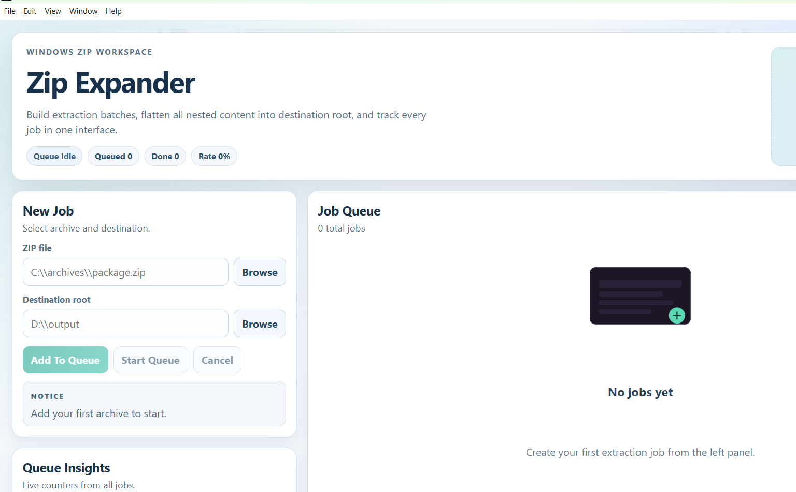

# Zip Expander

[](https://github.com/GeorgeWebDevCy/zip-expander/releases)
[](https://github.com/GeorgeWebDevCy/zip-expander/releases)
[](./package.json)

Zip Expander is a Windows desktop app that extracts a ZIP archive into a destination folder root, even when content is buried in deep folders or nested ZIP files.

Built with Electron + Next.js.

## Screenshot



## What It Does

Instead of recreating archive folder trees, Zip Expander flattens output to the destination root:

- `source/docs/readme.txt` -> `D:\Output\readme.txt`
- `source/a/b/c/image.png` -> `D:\Output\image.png`
- `source/nested/archive.zip` -> its extracted files also end up in `D:\Output\`

If names collide, files are auto-renamed safely:

- `report.txt`
- `report (1).txt`
- `report (2).txt`

## Key Features

- Recursive ZIP extraction (ZIP inside ZIP)
- Root flattening across unknown nesting depth
- Queue multiple jobs (processed sequentially)
- Per-job destination folders
- Continue queue when one job fails
- Password prompt for encrypted archives (up to 3 attempts)
- JSON report written in destination after each job
- Safety limits to protect against runaway extraction
- Windows installer and portable executable

## Download

Latest release:

- https://github.com/GeorgeWebDevCy/zip-expander/releases/latest

Artifacts include:

- `Zip.Expander.Setup.<version>.exe` (installer)
- `Zip.Expander-<version>-portable.exe` (portable)

## Code Signing (Free Option)

To reduce SmartScreen friction without paying for a commercial certificate, this repo now includes a GitHub Actions workflow:

- `.github/workflows/release-windows.yml`

It supports free signing through SignPath Foundation for open-source projects.

### One-Time Setup

1. Apply for SignPath Foundation at:
   https://about.signpath.io/
2. In your GitHub repo, add:
   - Repository secret: `SIGNPATH_API_TOKEN`
   - Repository variables:
     - `SIGNPATH_ORGANIZATION_ID`
     - `SIGNPATH_PROJECT_SLUG`
     - `SIGNPATH_SIGNING_POLICY_SLUG`
3. Push a tag like `v1.0.2` to trigger the workflow.

If these values are not configured, the workflow still publishes unsigned artifacts.

### SmartScreen Reality Check

- Windows SmartScreen reputation is still reputation-based, so a new app can show warnings at first even when signed.
- As of August 2024, Microsoft removed the special EV certificate requirement from its root program requirements, but reputation buildup still matters in practice.

## How To Use

1. Open Zip Expander.
2. Select a ZIP file.
3. Select a destination folder.
4. Add job to queue (repeat if needed).
5. Start queue.
6. Check the generated `extraction-report-*.json` in each destination folder.

## Safety Behavior

By default, the app:

- Skips symlink/reparse-point entries for safety
- Enforces extraction caps (depth, file count, total bytes, single file size)
- Stops current queue run on manual cancel
- Leaves clear failure messages and report output

## Build From Source

### Requirements

- Windows 10/11
- Node.js LTS
- 7-Zip (`7z.exe`) installed and available on `PATH` or at:
  `C:\Program Files\7-Zip\7z.exe`

### Development

```powershell
npm install
npm run assets:build
npm run dev
```

### Production Build

```powershell
npm run build
npm run dist
```

## Scripts

- `npm run test` - run unit tests
- `npm run fixtures:generate` - regenerate ZIP test fixtures
- `npm run smoke:test -- <fixture.zip>` - run extractor smoke test
- `npm run dist:installer` - build NSIS installer only
- `npm run dist:portable` - build portable executable only
- `npm run dist:unpacked` - build unpacked app folder
